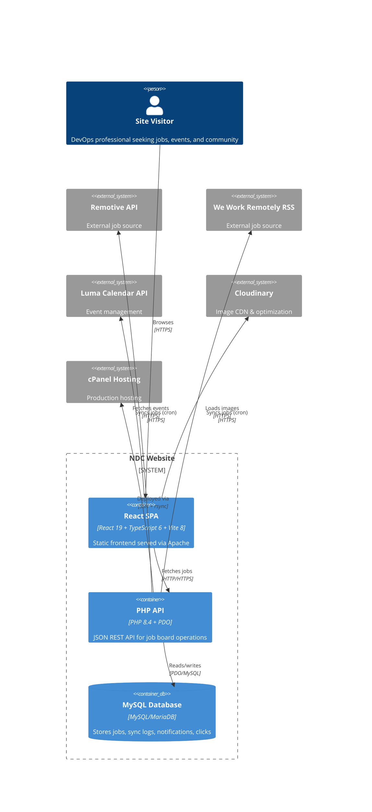
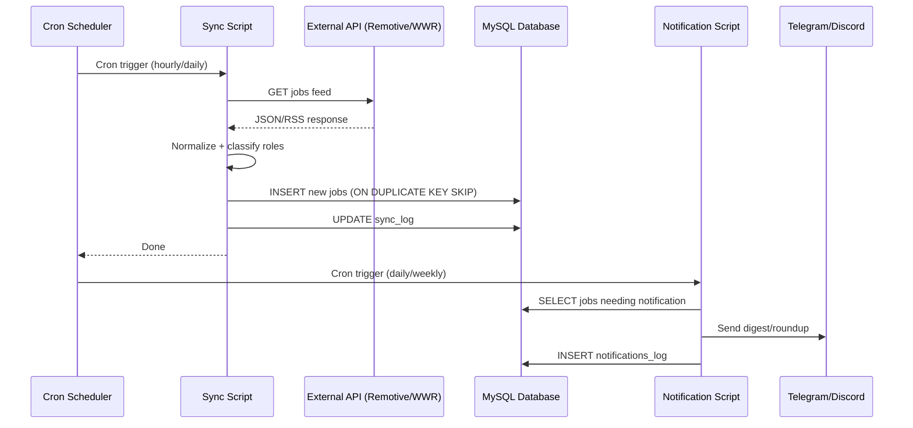

# Architecture Overview

## System Context

NDC is a community website for DevOps practitioners in Africa. It is a two-tier web application: a React SPA frontend served as static files, and a PHP JSON API backend backed by MySQL.



## Frontend Architecture

```mermaid
C4Container_Boundary(fe, "Frontend (React SPA)") {
  Container(app, "App.tsx", "Root component", "Sets up QueryClient, Theme, Router, Tooltip providers")
  Container(router, "Wouter Router", "Hash-based routing", "Maps paths to page components")
  Container(pages, "Page Components", "12 pages", "Home, About, Events, Blog, Jobs, FAQ, Community, Partners, Donate, Legal")
  Container(components, "UI Components", "51 shadcn/ui + custom", "Navbar, Footer, CloudinaryImage, SEO, SponsorsCarousel, TeamGallery")
  Container(hooks, "Custom Hooks", "useJobs, useLumaEvents, useCloudinaryFolder, useToast, useMobile", "Data fetching + UI logic")
  Container(query, "TanStack Query", "React Query 5", "Server state management, caching, background refetch")
  Container(lib, "Libraries", "Utils, constants, cloudinary, youtube, lumaCalendar", "Shared utilities")
  Container(contexts, "Contexts", "ThemeContext", "Dark/light mode")
}

Rel(app, router, "Renders")
Rel(router, pages, "Routes to")
Rel(pages, components, "Uses")
Rel(pages, hooks, "Uses")
Rel(pages, lib, "Uses")
Rel(hooks, query, "Uses for data fetching")
```

## Backend Architecture

```mermaid
C4Container_Boundary(be, "Backend (PHP API)") {
  Container(router, "index.php", "Single entry point", "Dispatches ?action= parameter")
  Container(endpoints, "Endpoints", "get_jobs, submit_job, track_click", "Request handlers")
  Container(contracts, "Contracts", "JobFetcherInterface, JobNormalizerInterface", "Source abstraction")
  Container(fetchers, "Fetchers", "RemotiveFetcher", "External API clients")
  Container(http, "HTTP Client", "CurlHttpClient", "cURL wrapper for external requests")
  Container(models, "Models", "NormalizedJob", "Data transfer objects")
  Container(db, "db.php", "PDO singleton", "Database connection")
  Container(helpers, "helpers.php", "Utility functions", "Salary parsing, sanitization, notifications, affiliate URLs")
}

Rel(router, endpoints, "Includes")
Rel(endpoints, helpers, "Uses")
Rel(endpoints, db, "Queries via")
Rel(fetchers, http, "Uses")
Rel(fethers, contracts, "Implements")
```

## Deployment Architecture

```mermaid
C4Deployment
  Deployment_Node(github, "GitHub") {
    Container(actions, "GitHub Actions", "16 workflows", "CI/CD pipeline")
    Container(repo, "Source Repository", "Git", "main (prod) + pre-staging + feature branches")
  }
  Deployment_Node(cpanel, "cPanel Server") {
    Deployment_Node(releases, "Releases Directory", "/home/releases/") {
      Container(prev, "Previous Release", "Symlink target", "Rollback target")
      Container(current, "Current Release", "Symlink: current -> release-N", "Active deployment")
      Container(staging, "Staging Release", "staging.nairobidevops.org", "Pre-production")
    }
    Container(web, "Apache Web Server", "Serves static SPA + proxies API")
    Container(php, "PHP-FPM", "PHP 8.4", "Runs API + cron")
    Container(mysql, "MySQL", "MariaDB", "Jobs database")
  }

  Rel(github, cpanel, "SSH deploy", "Atomic symlink switch")
  Rel(web, releases, "Serves from", "Current symlink")
  Rel(web, php, "Proxies API", "Apache ProxyPass")
```

## Data Flow: Job Sync



## Key Design Decisions

| Decision | Rationale |
|---|---|
| **Raw PDO, no ORM** | Keeps the backend lean. Only 4 tables + migrations. PDO prepared statements prevent SQL injection. |
| **Single-file API router** | `index.php?action=` keeps routing simple. Each endpoint is a separate PHP file that's `require_once`'d. |
| **Atomic symlink deploys** | Zero-downtime deployments. `current` symlink atomically switches to the new release. Previous release kept for instant rollback. |
| **Hash-based routing (Wouter)** | Simpler SPA routing for a static site. No server-side URL rewriting needed for client routes. |
| **Hardened builds** | Production builds strip console/debugger at two levels (esbuild + terser). No sourcemaps in prod. |
| **Generated column for NULL-safe sorting** | `closes_at_sort` substitutes a far-future sentinel for NULL, so "closing soon" sort works correctly without NULLs floating to the wrong end. |
