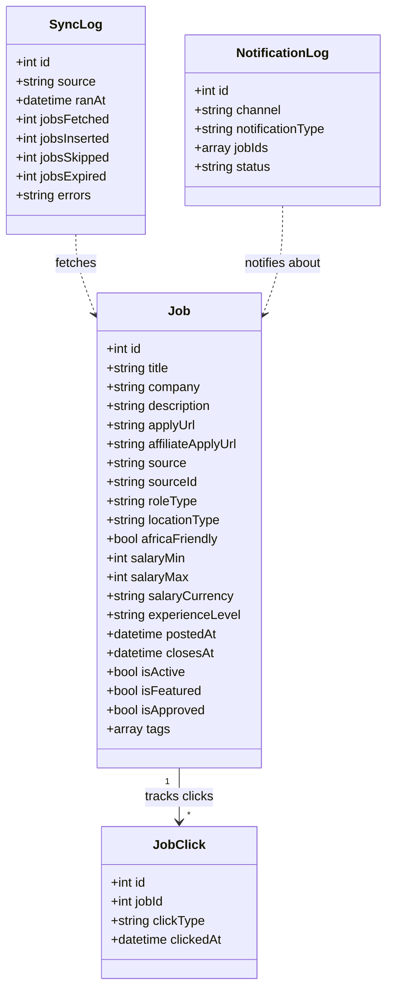

# Domain Model

## What is NDC?

**Nairobi DevOps Community (NDC)** is a community for DevOps practitioners, cloud engineers, SREs, and platform engineers in Africa. The website serves as a digital hub for:

- **Job board** — Africa-focused DevOps/cloud roles aggregated from Remotive and We Work Remotely, plus direct employer submissions
- **Events** — Community meetups imported from Luma Calendar API
- **Blog** — Community articles and guides
- **Community resources** — Code of conduct, FAQ, partner directory

## Core Domain: Job Board

The job board is the most feature-rich domain, with external sync pipelines, role classification, salary normalization, affiliate tracking, and multi-channel notifications.



### External Systems

| System | Integration | Data |
|---|---|---|
| **Remotive API** | JSON API, hourly cron sync | Remote job listings with salary data |
| **We Work Remotely RSS** | RSS feed, hourly cron sync | Remote job listings |
| **Luma Calendar API** | Client-side fetch via proxy | Community events |
| **Cloudinary** | Image CDN with React SDK | Optimized images, team photos |
| **Telegram Bot API** | Server-side POST via cron | Daily digest + weekly roundup notifications |
| **Discord Webhooks** | Server-side POST via cron | Daily digest + weekly roundup notifications |

### Data Flow: Job Sync Pipeline

```
External API (Remotive/WWR)
  → FetchJSON / FetchRSS
  → sanitizeString() each field
  → mapRoleType() classify title
  → parseSalary() normalize salary to monthly
  → buildAffiliateUrl() append tracking
  → INSERT INTO jobs (ON DUPLICATE KEY SKIP)
  → INSERT INTO sync_log
```

### Data Flow: Job Application

```
User clicks "Apply"
  → Frontend sends POST ?action=track
  → INSERT INTO job_clicks
  → redirect to apply_url (or affiliate_apply_url)
```

### Notification Flow

```
Cron trigger (daily/weekly)
  → SELECT jobs WHERE is_notified=0
  → Build message (Telegram Markdown)
  → sendToChannel('telegram') or sendToChannel('discord')
  → INSERT INTO notifications_log
  → UPDATE jobs SET is_notified=1
```

## Domain Concepts

| Concept | Description |
|---|---|
| **Role Type** | Job classification: SRE, Cloud Architect, Security, Platform Engineering, DevOps Engineer, Backend Engineer, Frontend Engineer, Sysadmin, Uncategorised |
| **Location Type** | `africa_remote`, `africa_onsite`, `international_remote` |
| **Africa-Friendly** | Flag indicating the role is open to African candidates (remote-friendly or Africa-based) |
| **Affiliate Tracking** | Remotive affiliate program — appends `?via=ID` to apply URLs for 30% commission |
| **Salary Normalization** | All salaries stored as monthly values regardless of source format |
| **Hardened Build** | Production build mode that strips console/debugger and omits sourcemaps |
