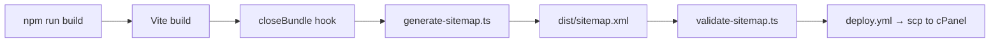

# Sitemap & Robots.txt Automation Guide

## Overview

The sitemap automation system generates, validates, and deploys `sitemap.xml` and `robots.txt` as part of the Vite build pipeline. It aligns with the existing cPanel deployment workflow.



## Architecture

| File | Purpose |
|------|---------|
| `scripts/generate-sitemap.ts` | Build-time generator — reads routes & blog data |
| `scripts/validate-sitemap.ts` | Post-build XML/URL validation (CI gate) |
| `scripts/deploy-sitemap.sh` | Ad-hoc scp upload to cPanel |
| `client/public/robots.txt` | Crawl directives + Sitemap URL |

## NPM Scripts

```bash
npm run sitemap:generate   # Generate sitemap.xml into dist/
npm run sitemap:validate   # Validate dist/sitemap.xml + robots.txt
npm run sitemap:deploy     # Upload via scp (requires env vars)
```

## How It Works

### 1. Build-Time Generation

The Vite config includes a custom `sitemapPlugin` that runs `generateSitemap()` in the `closeBundle` hook. This happens automatically during `npm run build` for production/staging modes.

The generator:
- Reads **11 static routes** from a hardcoded route map (mirrors `App.tsx`)
- Dynamically imports `blogData.ts` to resolve all `/blogs/:slug` URLs
- Writes valid XML with `<lastmod>`, `<changefreq>`, and `<priority>` tags
- All URLs use HTTPS and the `https://nairobidevops.org` hostname

### 2. CI Validation

The `deploy.yml` workflow runs `npm run sitemap:validate` after every build. This step:
- Checks `sitemap.xml` exists and is non-empty
- Validates XML declaration and namespace
- Ensures all `<loc>` URLs are HTTPS
- Validates `<lastmod>` date formats
- Checks `robots.txt` contains a `Sitemap:` directive
- **Fails the build** if any check fails

### 3. Deployment

The sitemap is deployed automatically with the rest of the `dist/` directory via the existing `deploy.yml` → `scp` → atomic symlink pipeline. No extra steps needed.

For ad-hoc updates (e.g., after a cron regeneration), use:

```bash
export REMOTE_HOST=your-server.com
export REMOTE_USER=your-user
export REMOTE_PATH=/home/your-user/public_html
bash scripts/deploy-sitemap.sh
```

## Adding New Routes

When you add a new `<Route>` in `App.tsx`:

1. Open `scripts/generate-sitemap.ts`
2. Add the route to the `staticRoutes` array:
   ```typescript
   { loc: "/new-page", changefreq: "monthly", priority: "0.7", lastmod: today },
   ```
3. Rebuild: `npm run build`
4. Blog routes (`/blogs/:slug`) are resolved automatically from `blogData.ts`

## cPanel Cron Job Setup

For sites with frequently changing content, set up a cron job in cPanel:

1. **SSH into your server** and create a regeneration script:

   ```bash
   #!/bin/bash
   # /home/user/scripts/regenerate-sitemap.sh
   cd /home/user/project
   npx tsx scripts/generate-sitemap.ts
   cp dist/sitemap.xml /home/user/public_html/sitemap.xml
   ```

2. **In cPanel → Cron Jobs**, add:

   ```
   0 3 * * * /bin/bash /home/user/scripts/regenerate-sitemap.sh >> /home/user/logs/sitemap-cron.log 2>&1
   ```

   This runs daily at 3:00 AM.

> [!TIP]
> For the current static blog data, a cron job is unnecessary — the sitemap is generated fresh with every deploy.

## Google Search Console Submission

1. Go to [Google Search Console](https://search.google.com/search-console)
2. Select the `nairobidevops.org` property
3. Navigate to **Sitemaps** (left sidebar)
4. Enter `https://nairobidevops.org/sitemap.xml`
5. Click **Submit**
6. Google will periodically re-crawl the sitemap

## CDN Cache Purging

After deploying a new sitemap, purge the CDN cache for:
- `/sitemap.xml`
- `/robots.txt`

If using Cloudflare: **Caching → Purge Cache → Custom Purge** → enter the URLs.

## Security Best Practices

> [!CAUTION]
> **SSH Keys Only.** The `deploy-sitemap.sh` script uses SSH key authentication exclusively. Never use password authentication for automated deployments.

- **Never commit private keys** — use GitHub Secrets or environment variables
- **Restrict key permissions**: `chmod 600 ~/.ssh/id_rsa`
- **Use `StrictHostKeyChecking=yes`** (already configured in the script)
- **Rotate SSH keys periodically** — especially if a team member leaves
- **Limit the deploy key's server access** — use a dedicated deploy user with minimal permissions

## Troubleshooting

| Issue | Solution |
|-------|----------|
| `sitemap.xml not found in dist/` | Run `npm run build` — the plugin only runs in production/staging mode |
| Blog slugs not in sitemap | Check `blogData.ts` exports `blogPosts` array with `slug` properties |
| Validation fails in CI | Check `npm run sitemap:validate` locally for detailed error messages |
| `scp` permission denied | Verify SSH key matches server, check `authorized_keys` on cPanel |
| Sitemap not updating after deploy | Purge CDN cache, check symlink target with `ls -la public_html` |
